# Лабораторная работа №1. HTTP

## Задание 1. Анализ HTTP-запросов. Часть 1

- Перейти по ссылке :  https://en.wikipedia.org/wiki/HTTP

- Изучить аспекты http запроса :

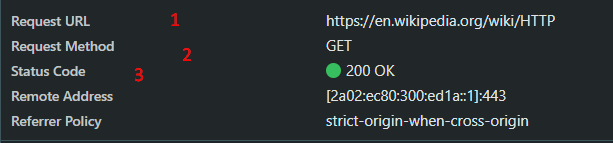

1. **URL запроса** : адрес, который указывает место расположения, ресурса 

2. **Метод запроса** :
В нашем случае это метод GET, для загрузки страницы испольузется именно этот метод, так как именно он, позволяет получить содержимое ресурса, к которму мы обращаемся 

3. **Статус ответа** : 
200 OK - Запрос успешно выполнен

***

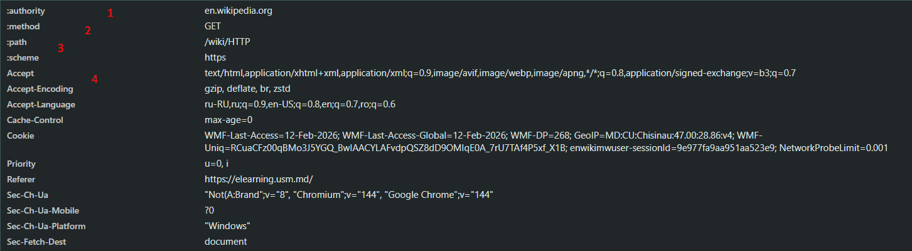

- *:authority* - к какому домену отправлятется запрос, аналог HOST
- *:method* - какой метод используется в данном запросе, в нашем случае GET
- *:path* - путь к ресурсу на сервер, указывается после домена.
- *Accept* - какие форматы файлов мы хотим получить (html, xml, картинки и т.д.)

***

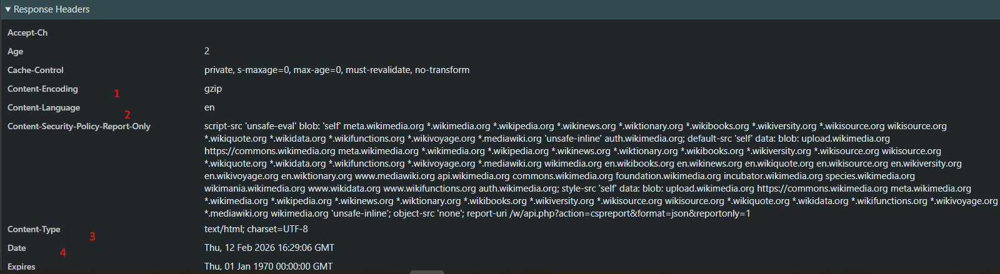
- *Content-Encoding* - каким способом сжат ответ сервера. В данном случае gzip
- *Content-Language* - язык ответа, в нашем случае англиский 
- *Content-Type* - кодировка charset=UTF-8 
- *Date* - дата и время формирования ответа

***

4. **Тело запроса отстутствует**, так как GET - преднозначен для получения данных. 
5. **Тело ответа** - html файл со страницей, которую мы запросили.
6. **Другие запросы, отправленные при загрузке страницы**
Как мы видим, был отправлен в общей сумме 51 запрос.Браузер загружает картинки, css стили, иконки,скрипты js и т.д.

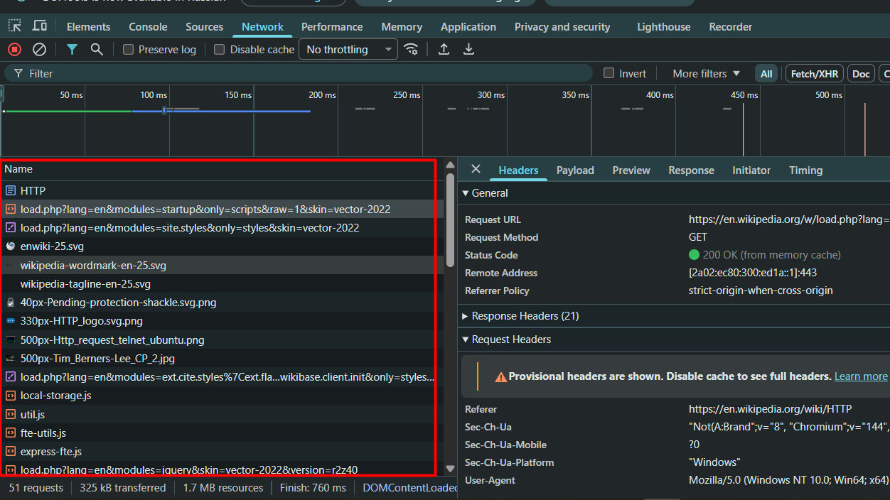

***

7. **Переходим по следующему адресу :** https://en.wikipedia.org/wiki/HTTPdsfdfs 

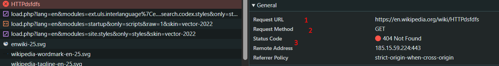

- URL запроса : Адрес, который указывает место расположения, ресурса. В данном примере адресс некоректен
- Метод запроса : Как и в предыдущем случае сипользуется метод GET, для загрузки страницы
- Статус ответа : 404 Not Found - Запрашиваемый ресурс не найден. ***Причина : мы указали путь /wiki/HTTPdsfdfs, а такой страницы не существует***
- Имеет большую часть общих заголовков, но самое важное отличие, в path

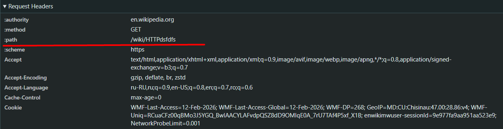

## Задание 2. Анализ HTTP-запросов. Часть 2

- Переходим по : https://en.wikipedia.org/wiki/Special:Search
Делаем поиск как указано в примере.

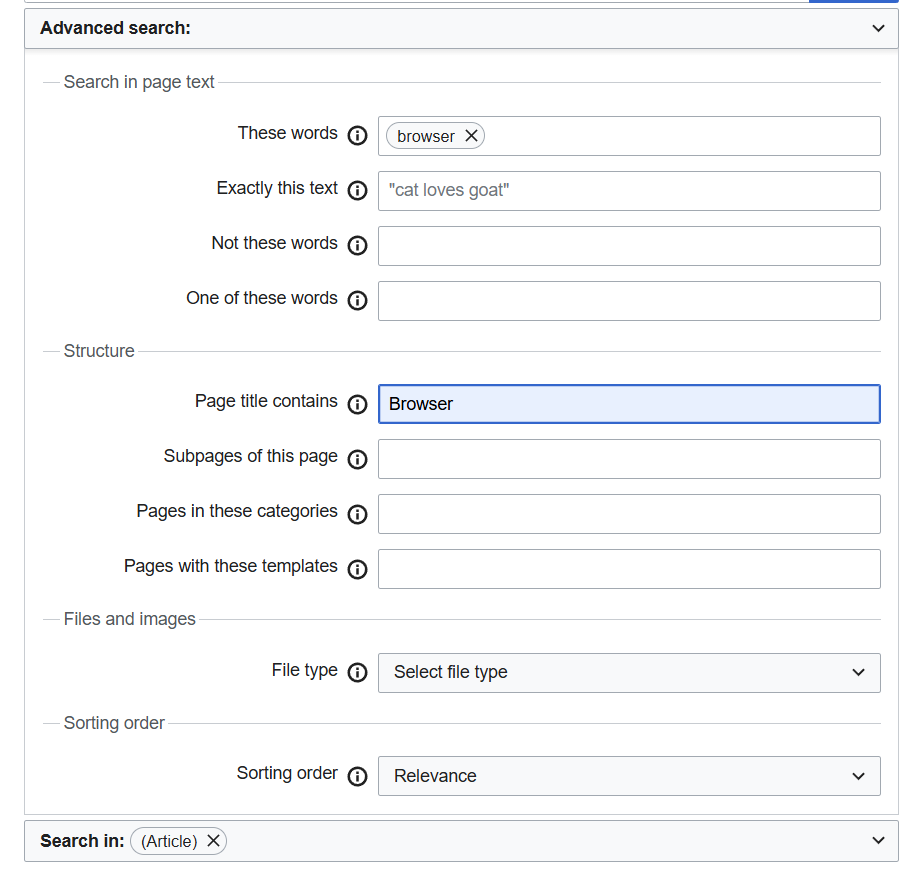

- **Аспекты запроса :** 

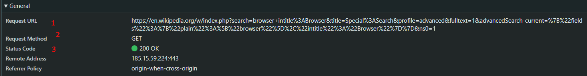

    1. URL запрос
    2. Метод запроса : используется метод GET, для загрузки страницы. Используется именно этот метод, так как мы хотим получит некоторую страницу - как ответ
    3. Статус ответа : 200 OK - Запрос успешно выполнен
    4. Query Parameters : Дополнительные параметры, добавляемые в URL после ? для уточнения запроса ( фильтрация,сортировка, уточнения). Представляют из себя пары ключ = значение. 
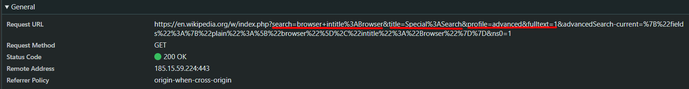

## Задание 3. Анализ HTTP-запросов. Часть 3

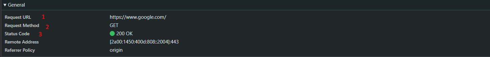

1. **URL запроса :** https://www.google.com/
2. **Метод запроса :** GET - так как мы получаем главную страницу гугла.
3. **Статус ответа :** 200 OK - Запрос успешно выполнен

4. **Заголовки запроса**

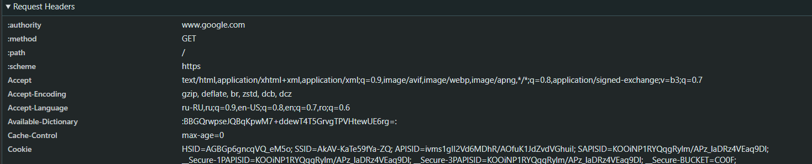

- Accept – форматы данных, которые клиент может принять (html, image, xml)
- Accept-Encoding – поддерживаемые способы сжатия 
- Accept-Language – поддерживаемые языки ответа

***

5. **Заголовки ответа :**

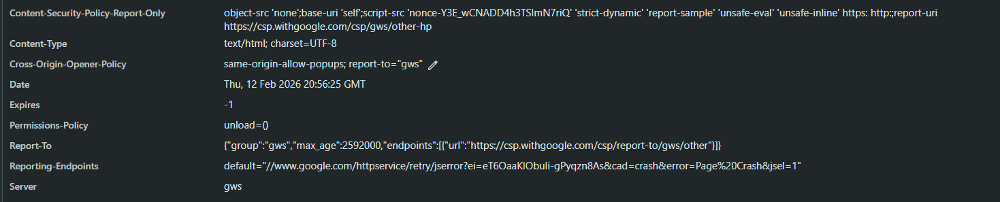

- Content-Type – тип возвращаемого ресурса (text/html charset=UTF-8)
- Content-Security-Policy-Report-Only – политика безопасности страницы
- Date – дата и время формирования ответа
- Server – тип сервета, в нашем случае qws

***

6. ***Тело запроса отсутствует, так как используется метод GET, который запрашивает ресурсы***
7. **Тело ответа - html страница ( главная страница google)**
8. **Другие запросы, отправленные при загрузке страницы (всего 84 запроса) :**
    1. Запрос на получение иконок/ картинок
    2. JS скрипты
    3. CSS и т.д.
 
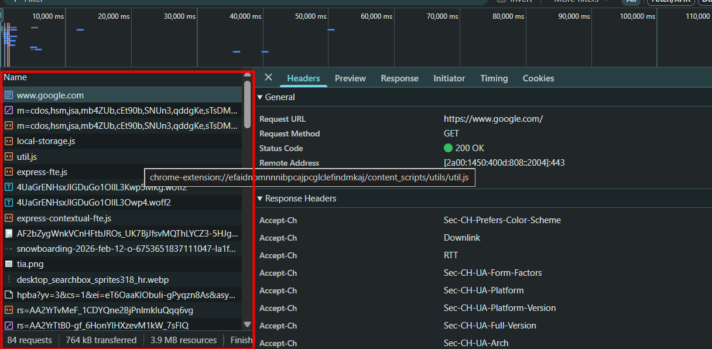

***

## Задание 4. Составление HTTP-запросов

1. Составьте GET-запрос к серверу по адресу http://sandbox.usm.com, указав в заголовке User-Agent ваше имя и фамилию.

```
GET / HTTP/1.1  
Host : sandbox.usm.com
User-Agent : Borisenco_Daria 
```

2. Составьте POST-запрос к серверу по адресу http://sandbox.usm.com/cars, указав в теле запроса следующие параметры:

- make: марка автомобиля (например, "Toyota")
- model: модель автомобиля (например, "Corolla")
- year: год выпуска автомобиля (например, 2020)

```
POST /cars HTTP/1.1
Host : sandbox.usm.com
User-Agent : Borisenco_Daria 
Content-Type: application/json
{
    "make": "Toyota",
    "model": "Corolla",
    "year": 2019
}

```

3. Составьте PUT-запрос к серверу по адресу http://sandbox.usm.com/cars/1, указав в заголовке User-Agent ваше имя и фамилию, в заголовке Content-Type значение application/json и в теле запроса следующие параметры:
```
{
 "make": "Toyota",
 "model": "Corolla",
 "year": 2021
}
```

```
PUT /cars/1 HTTP/1.1
Host: sandbox.usm.com
User-Agent: Darya Ivanova
Content-Type: application/json
{
  "make": "Toyota",
  "model": "Corolla",
  "year": 2021
}
```

4. Напишите один из возможных вариантов ответа сервера следующий запрос:

```
POST /cars HTTP/1.1
Host: sandbox.com
Content-Type: application/json
User-Agent: John Doe
model=Corolla&make=Toyota&year=2020
```

```
HTTP/1.1 201 Created 
Content-Type: application/json
{
    "model" : "Corolla",
    "make" : "Toyota",
    "year" : 2020
}
```

5. Сервер может вернуть следующие коды : 
    - 200 OK рсурс создана успешно и сервер возвращает результат
    - 201 Created ресурс успешно создан
    - 400 Bad Request неверно введены данные
    - 401 Unauthorized не пройдена авторизация
    - 403 Forbidden доступ запрещён
    - 404 Not Found URL /cars не существует
    - 500 Internal Server Error ошибка на сервере
