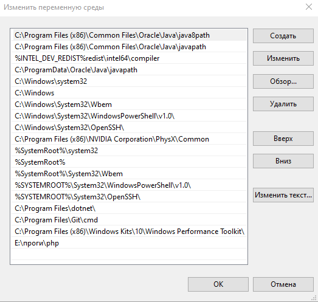
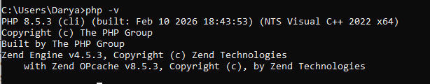
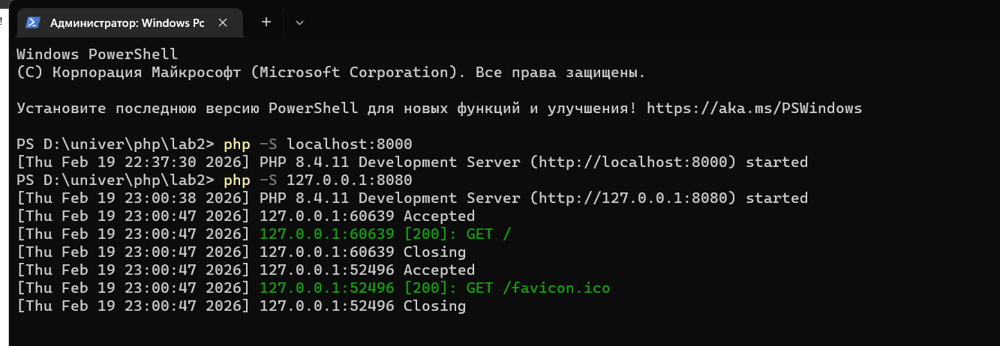
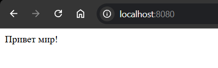
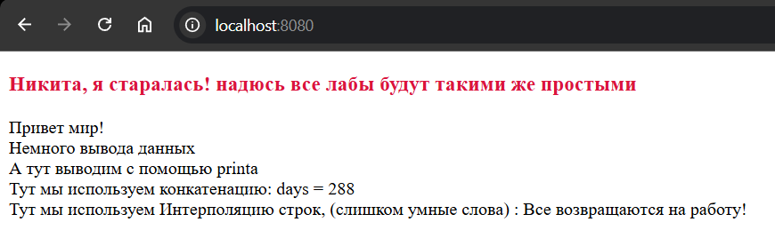

# Лабораторная работа №2. Установка и первая программа на PHP

- Выполнил студент: Борисенко Дарья 
- Группа: IA2403
- Преподоватерь: Нартя Никита


## Задача номер 1. Установка php 

Для установки php, мною был выбран первый способ

- Перешла на официальный сайт PHP: https://www.php.net/downloads.

- Загрузила актуальную версию PHP в моем случае это: VS17 x64 Non Thread Safe 
- Распаковала архив в папку php
- Добавила путь к PHP в переменные среды (Path)



- Проверила установку, выполнив в командной строке: php -v.



## Задача номер 2. Написание первой php программы. 

Создала index.php и в него добавила код :
```
<?php

echo "Привет, мир!";
?>
```

Запустила php файл с помощью встроеного веб сервера. Для этого в терминале написала следующую команду :

`php -S localhost:8080`



После чего в браузере ввела http://localhost:8080. И в браузере мы увидели сообщение "Привет мир!"



## Задача номер 3. Вывод данных в PHP, работа с переменными и выводом 

Я решила объеденить 2 пункта, дабы вставить весь код вместе. 

Задача была следующая : 

- Вывести строку "Hello, World!" используя функцию echo и print.
- Создать две переменные :
    - Целочисленную переменную $days со значением 288.
    - Строковую переменную $message с текстом: Все возвращаются на работу!.
- Вывести значения переменных на экран несколькими способами:
    - С использованием конкатенации
    - С использованием двойных кавычек

Эти задачи были реализованы в коде ниже : 

```
<?php

$days = 288;
$message = "Все возвращаются на работу!";
?>

<!DOCTYPE html>
<html>

<head>
    <meta charset="UTF-8">
    <title>Моя страница</title>


    <style type="text/css">
        h3 {
            color: crimson;
        }
    </style>
</head>

<body>
    <h3>
        <?php

        echo  " Никита, я старалась! надюсь все лабы будут такими же простыми";?>

    </h3>
    <?php

    echo "Привет мир!";?>
    <br />
    <?php
    echo "Немного вывода данных";?>
    <br />
    <?php
    print("А тут выводим с помощью printa")?>
    <br />
    <?php

    echo "Тут мы используем конкатенацию: days = " . $days;?>
    <br />
    <?php

    echo "Тут мы используем Интерполяцию строк, (слишком умные слова) : {$message}";?>
</body>
</html>
```



