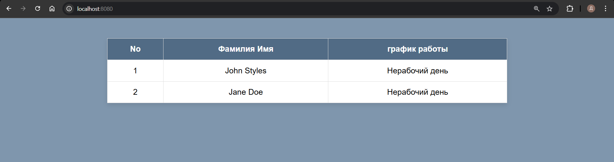
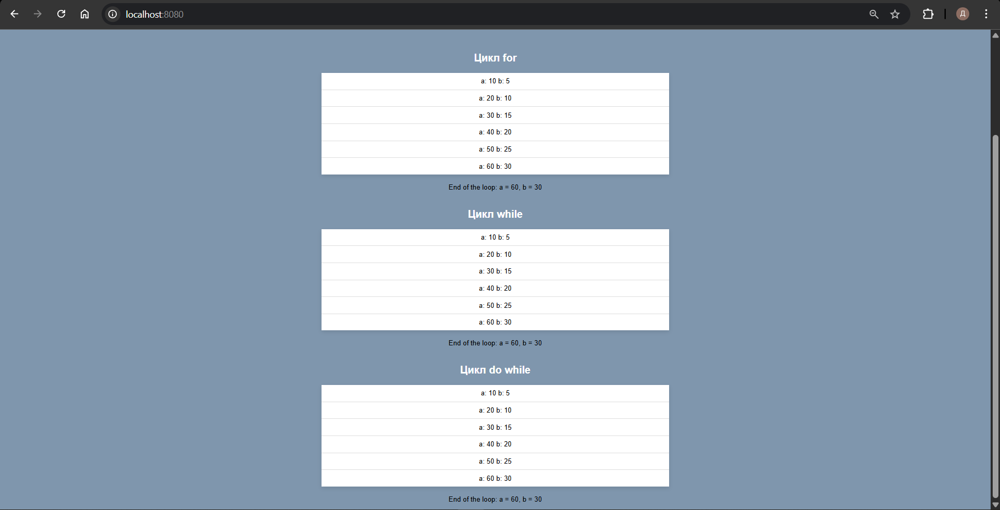

# Лабораторная работа №3. Управляющие конструкции

- Выполнил студент: Борисенко Дарья
- Группа: IA2403
- Преподоватерь: Нартя Никита

## Условные конструкции

Необходимо было реализовать формирование расписания сотрудников с использованием условных конструкций языка PHP и функции date() и добавить его в таблицу.

Со следующим условием: 

- Для John Styles (xx - xx):
    - Если текущий день недели — понедельник, среда или пятница, график работы 8:00-12:00.
    - В остальные дни недели текст: Нерабочий день.
- Для Jane Doe (yy - yy):
    - Если текущий день недели — вторник, четверг или суббота, график работы 12:00-16:00.
    - В остальные дни недели текст: Нерабочий день.


Результат выполнения : 



Реализация кода ( немного добавила от себя): 

```php
    <?php
    $date = date("N");
    
    $worcableDay =  [[1, 3, 5], [2, 4, 6]];

    function workableDate(int $num): string
    {
        global $date;
        global $worcableDay;
        if (!in_array($date, $worcableDay[$num])) {
            return "Нерабочий день";
        } else {
            return $num = 0 ? "8:00-12:00" : "12:00-16:00";
        }
    }
    ?>

    <h2>Условные конструкции</h2>
    <table border="1">
        <tr>
            <th>No</th>
            <th>Фамилия Имя</th>
            <th>график работы</th>
        </tr>
        <tr>
            <td>1</td>
            <td>John Styles</td>
            <td>
                <?php
                echo workableDate(0);
                ?>
            </td>
        </tr>
        <tr>
            <td>2</td>
            <td>Jane Doe</td>
            <td>
                <?php
                echo workableDate(1);
                ?>
            </td>
        </tr>
    </table>
    </br>
```

## Циклы

Было необходимо создать отдельный файл, но я продолжила работу в одном для удобства, и поместить туда следующий код : 

```php 
<?php

$a = 0;
$b = 0;

for ($i = 0; $i <= 5; $i++) {
    $a += 10;
    $b += 5;
}

echo "End of the loop: a = $a, b = $b";
```

Далее необходимо было модифицировать данный код, так что бы в каждой итерации цикла выводились значения a, b на экран. 
Так же необходимо было переписать данный цикл for в while и do while, после чего так же вывести результат на экран. 

Для красоты вывода, было принято решение выводить значения в список, для каждого цикла. 

Результат : 


Код: 

```php

    <h2>Цикл for </h2>

    <?php
    $a = 0;
    $b = 0;
    $iteration = 0;

    function setDefault()
    {
        return [0,0,0];
    }
    ?>
    <ul>
        <?php
        for ($i = 0; $i <= 5; $i++) {
            $a += 10;
            $b += 5; ?>
            <li>
                <?php echo "a: " . $a . " b: " . $b; ?>
            </li>
        <?php}?>
    </ul>
    <p>
        <?php
        echo "End of the loop: a = $a, b = $b";
        ?>
    </p>
    <h2>Цикл while </h2>
    <ul>
        <?php
        [$a,$b,$iteration] = setDefault();
        while ( $iteration <= 5) 
        {
            $a += 10;
            $b += 5; 
            $iteration++;   ?>
            <li>
                <?php echo "a: " . $a . " b: " . $b; ?>
            </li>
        <?php}?>
    </ul>
    <p>
        <?php
        echo "End of the loop: a = $a, b = $b";
        ?>
    </p>
    <h2>Цикл do while </h2>
    <ul>
        <?php
        [$a,$b,$iteration] = setDefault();
        do
        {
            $a += 10;
            $b += 5; 
            $iteration++;   ?>
            <li>
                <?php echo "a: " . $a . " b: " . $b; ?>
            </li>
        <?php
        }while ( $iteration <= 5) ;
        ?>
    </ul>
    <p>
        <?php
        echo "End of the loop: a = $a, b = $b";
        ?>
    </p>

```
## Контрольные вопросы

- В чем разница между циклами for, while и do-while? В каких случаях лучше использовать каждый из них?
    - for используется тогда, когда нам точно известно количество итераций, необходимых к выполнению.
    - while, наоборот, в тех ситуациях, когда нам точно неизвестно, сколько раз необходимо повторить действие
    - do while, работает так- же как и while, за тем исключением, что он гарантировано сработает 1 раз, тогда как while, может и не сделать ни одного оборота цикла
- Как работает тернарный оператор ? : в PHP?
    - тернарный оператор имеет вид: $var = условие ? значение_если_Истинно : значение_если_Ложно;
    то есть переменнуй $var присовится значение в зависимости от того, выполнилось ли условие проверки или нет. 
- Что произойдет, если в do-while поставить условие, которое изначально ложно?
    - Цикл выполнится 1 раз, так как в начале идет действие, а потом проверка.

## Источники 
- [тут про дату](https://webcademy.ru/blog/233/)
- [moolde](https://elearning.usm.md/course/view.php?id=7161)
- [про массивы](https://www.php.net/manual/en/function.in-array.php)