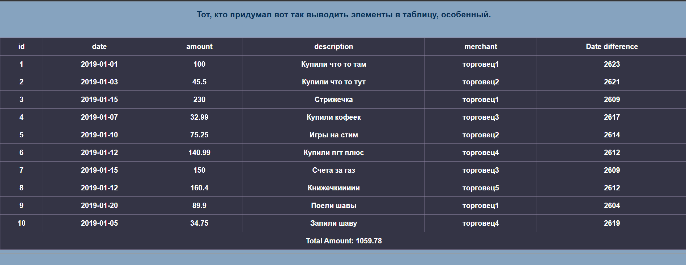
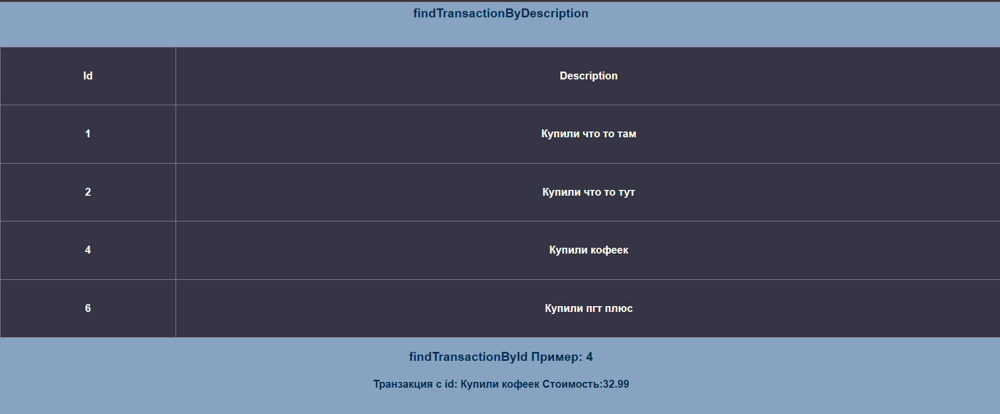
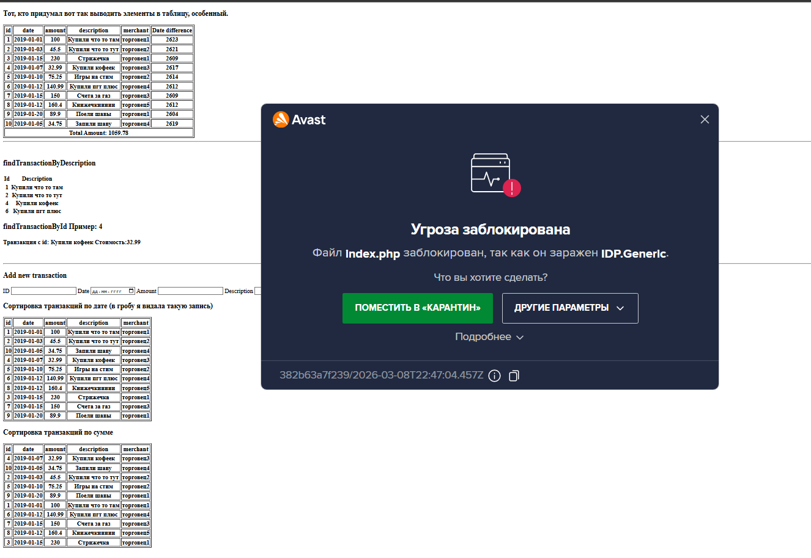
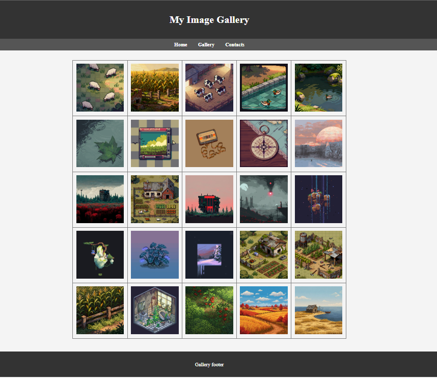
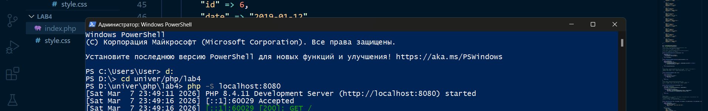
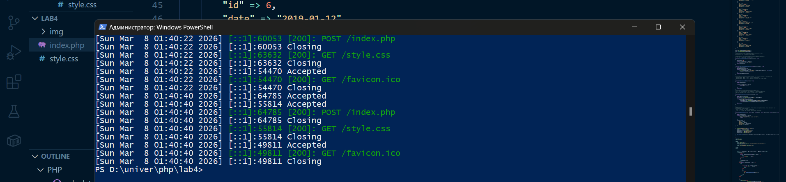
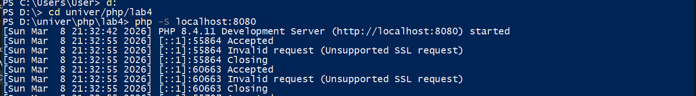

# Лабораторная работа №4. Массивы и Функции

- Выполнил студент: Борисенко Дарья
- Группа: IA2403
- Преподоватерь: Нартя Никита

## Цель работы

Освоить работу с массивами в PHP, применяя различные операции: создание, добавление, удаление, сортировка и поиск. Закрепить навыки работы с функциями, включая передачу аргументов, возвращаемые значения и анонимные функции.

## Задание 1: Создание массива транзакций

Пример: 
- `id` – уникальный идентификатор транзакции;
- `date` – дата совершения транзакции (YYYY-MM-DD);
- `amount` – сумма транзакции;
- `description` – описание назначения платежа;
- `merchant` – название организации, получившей платеж.

Пример Транзакций : 
```php
$transactions = [
    [
        "id" => 1,
        "date" => "2019-01-01",
        "amount" => 100.00,
        "description" => "Купили что то там",
        "merchant" => "торговец1",
    ],
    [
        "id" => 2,
        "date" => "2019-01-03",
        "amount" => 45.50,
        "description" => "Купили что то тут",
        "merchant" => "торговец2",
    ]
];
```
## Задание 1.1 : Вывод списка транзакций

Используем `foreach`, чтобы вывести список транзакций в HTML-таблице.

Пример кода :
```php
    <table border='1'>
        <tr>
            <?php
            foreach ($transactions[0] as $key => $value) { ?>
                <th>
                    <?php echo " " . $key; ?>
                </th>
            <?php
            }
            ?>
        </tr>
        <?php foreach ($transactions as $el) { ?>
            <tr>

                <?php foreach ($el as $key => $value) { ?>
                    <th>
                        <?php echo " " . $value; ?>
                    </th>
                <?php
                }
                ?>
            </tr>
        <?php
        }
        ?>
    </table>
```

## Задание 1.2 : Реализация функций

Реализованые функции: 

- `function calculateTotalAmount(array $transactions): float{...}` - Вычисляет общую сумму всех транзакций 

- `function findTransactionByDescription(string $descriptionPart): array{...}` - Ищет транзакцию по части описания

- `function findTransactionById(int $id): ?array{...}` - Ищет транзакцию по идентификатору

- `function daysSinceTransaction(int $trnsactionId): ?int{...}` - Возвращает количество дней между датой транзакции и текущим днем

- `function addTransaction(int $id, string $date, float $amount, string $description, string $merchant): void{...}` - Добавляет новую транзакцию в массив

- `function usortDate($a, $b): int{...}` - Вспомогательная функция для сортировки, сравнивает даты двух транзакций.

- `function usortAmount($a, $b): int{...}` - Вспомогательная функция для сортировки, сравнивает суммы двух транзакций.

Пару фоточек для демонстрации работы: 





Ну и немного приколов аваста) 



## Задание 2. Работа с файловой системой

Создала папку image - куда сскачала 25 картинок. 
После чего был создан отдельный index.php где был реализован код для вывода картинок в таблицу 

```php
<table border='1'>
        <?php
        foreach ($files as $file) {
            if ($file != "." && $file != "..") {

                if ($count % 5 == 0) { ?>
                    <tr>
                    <?php
                }
                    ?>
                    <td>
                        " width="150">
                    </td>
                    <?php
                    $count++;
                    if ($count % 5 == 0) {
                    ?>
                    </tr>
                    <?php
                    }
                }
            }
        ?>
    </table>
```

Результат: 



Ну и немного о том, как долго я делала эту лабу...

P.S. тут не все время, добавить сверху еще часа 2 






Библиография: 

## Источники 

- [moolde](https://elearning.usm.md/mod/assign/view.php?id=301600)
- [книжка в бумаге по пхп](https://librarius.md/ru/book/sozdaem-dinamicheskie-veb-sayty-na-php-672134)